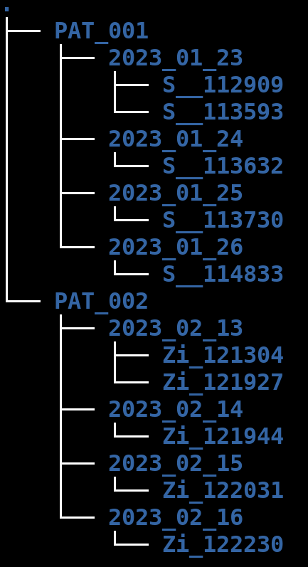
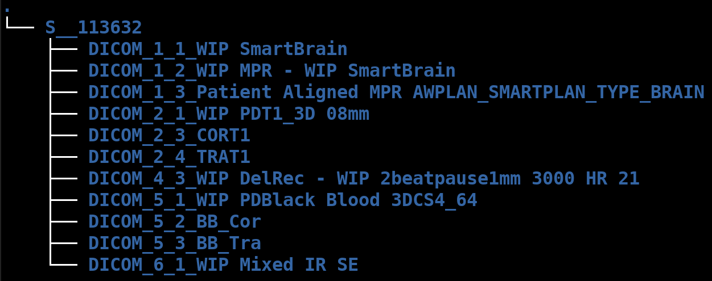
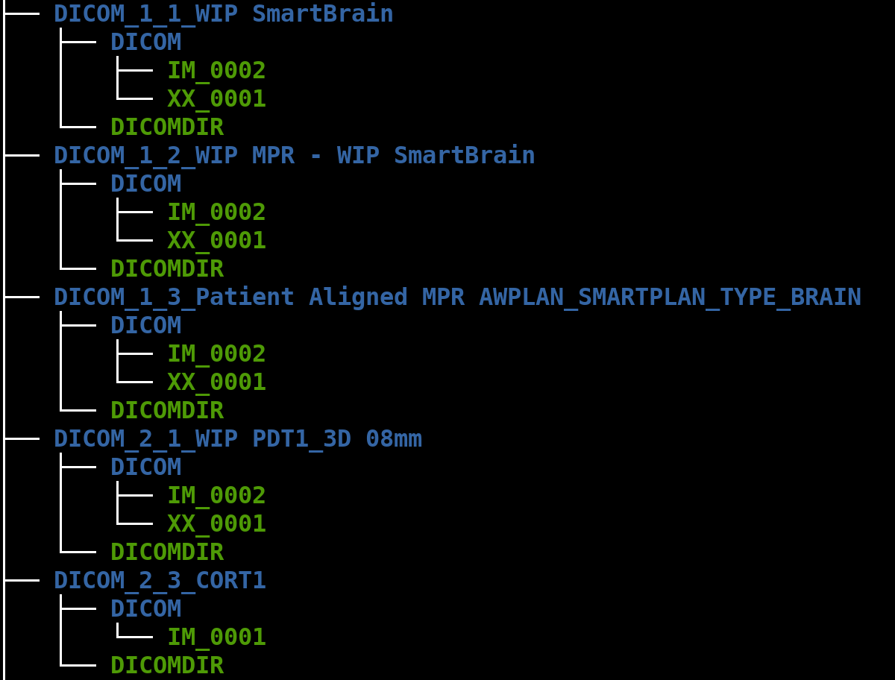
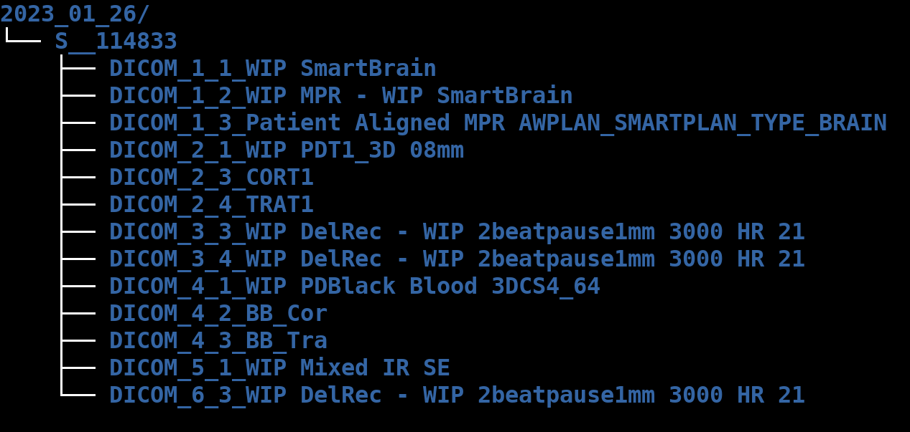

Requirements:
- dcm2niix

# Data Structure
## GRIP ("Raw data" or data received from the hospital)
From the top-level the `GRIP`-folder containing the data as we get them from the hosptial is organized as follows:

There seems to be a myriad of various sequence, for which many of them contain the exact data (e.g. CORT1, TRAT1 and PDT1_3D). It does not seem to be any consistency in the numbering of the various sequnces.

For some of the datasets of interest, the sequence name changes between patients (or even studies), so for each new patient, one needs to identify the naming of the data for this patient.

In some cases, there are even multiple folders/sequences with the same "name-tag", differing only in the numbering (`DICOM_X_Y_[SAMENAME]`):

## MRI Preprocessing

1. Extract MR-images from DICOM. This is done using the script `multiframe_dicom.py` (assuming the DICOM images are in "multiframe" or "enhanced" format. Otherwise, see the outdated `sort_mri_old.py` for traditional format). The images are extracted in `.nii`-format.

### Concentration Estimation